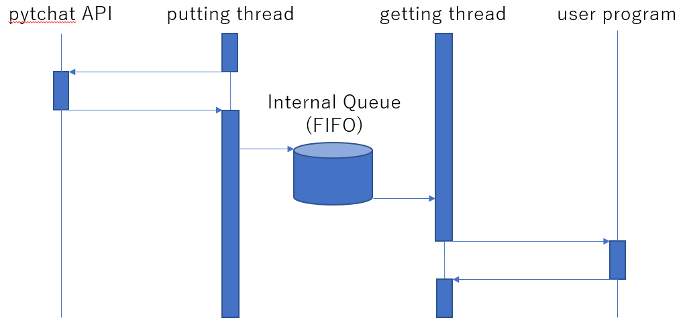

# StreamChatAgent
YouTube chat poller which can get massages very smothly by using internal queue.

## The user of this library can
- receive YouTube chat messages continiously by registering callback.
- natively obtain high performance by using internal queue.

## Hou to install
You can select from following ways.

### Install from PyPI
- Install package to your environment.<br>
    ```install
    $ pip install streamchat-agent
    ```

### Install from GitHub repository
- Clone this repository.<br>
    ```clone
    $ clone https://github.com/GeneralYadoc/StreamChatAgent.git
    ```
- Change directory to the root of the repository.<br>
    ```cd
    $ cd StreamChatAgent
    ```
- Install package to your environment.<br>
    ```install
    $ pip install .
    ```

## How to use

- Sample codes exists [here](samples/sample.py)<br>
    ``` sample.py
    import sys
    import re
    import StreamChatAgent as sca  # Import this.

    # callback for getting YouTube chat item
    # You can implement several processes in it.
    # This example prints datetime, ahthor name, message, of each item.
    def get_item_cb(c):
      print(f"{c.datetime} [{c.author.name}]- {c.message}")

    # pre putting queue filter
    # You can edit YouTube chat item before putting internal queue.
    # You can avoid putting internal queue by returning None.
    # This example removes item whose message consists of stamps only.
    def pre_filter_cb(c):
      return None if re.match(r'^(:[^:]+:)+$', c.message) else c

    # post getting queue filter
    # You can edit YouTube chat item after popping internal queue.
    # You can avoid sending item to get_item_cb by returning None.
    # This example removes stamps from message of item.
    def post_filter_cb(c):
      c.message = re.sub(r':[^:]+:','', c.message)
      return c

    # Video ID is given from command line in this example.
    if len(sys.argv) <= 1:
      exit(0)

    # Create StreamChatAgent instance.
    params = sca.params(
      video_id = sys.argv[1],
      get_item_cb = get_item_cb,
      pre_filter_cb = pre_filter_cb,
      post_filter_cb = post_filter_cb
    )
    agent = sca.StreamChatAgent( params )

    # Start async getting YouTube chat items.
    # Then get_item_cb is called continuosly.
    agent.start()

    # Wait any key inputted from keyboad.
    input()

    # Finish getting items.
    # Internal thread will stop soon.
    agent.disconnect()

    # Wait terminating internal threads.
    agent.join()

    del agent
    ```

- Output of the sample
    ```output
    % python3 ./sample.py MB57rMXXXXs
    2023-05-19 05:21:26 [John]- Hello!
    2023-05-19 05:21:27 [Kelly]- Hello everyone!
    2023-05-19 05:21:27 [Taro]- Welcome to our stream.
    ```
## Params given to Constructor
- StreamChatAgent object can be configured with following arguments of its constractor.

    | name | description | default |
    |------|------------|---------|
    | video_id | String following after 'v=' in url of target YouTube live | - |
    | get_item_cb | Chat items are thrown to this callback | - |
    | pre_filter_cb | Filter set before internal queue | None |
    | post_filter_cb | Filter set between internal queue and get_item_cb | None |
    | max_queue_size | Max slots of internal queue (0 is no limit) | 1000 |
    | interval_sec | Polling interval of picking up items from YouTube | 0.01 \[sec\] | 

## Methods
### start()
- Start polling and calling user callbacks asyncronously.
- No arguments required, nothing returns.

### join()
- Wait terminating internal threads kicked by start().
- No arguments required, nothing returns.

### connect()
- Start polling and calling user callbacks syncronously.
- Lines following the call of the method never executen before terminate of internal threads.
- No arguments required, nothing returns.

### disconnect()
- Request to terminate polling and calling user callbacks.
- Internal process will be terminated soon after.
- No arguments required, nothing returns.

And other [threading.Thread](https://docs.python.org/3/library/threading.html) public pethods are available.

## Callbacks
### get_item_cb
- Callback for getting YouTube chat items.
- You can implement several processes in it.
- YouTube chat item is thrown as an argument.
- It's not be assumed that any values are returned.
### pre_filter_cb
- pre putting queue filter.
- YouTube chat item is thrown as an argument.
- You can edit YouTube chat items before putting internal queue.
- It's required that edited chat item is returned.
- You can avoid putting internal queue by returning None.
### post_filter_cb
- post getting queue filter
- You can edit YouTube chat items after popping internal queue.
- It's required that edited chat item is returned.
- You can avoid sending item to get_item_cb by returning None.

## Type of YouTube Chat item
- Please refer [pytchat README](https://github.com/taizan-hokuto/pytchat)

## Concept of design
- Putting thread is separated from getting thread in order to avoid locking polling.<br>
Unexpected sleep of pytchat may reduce by ths approach.
- If internal queue is full when putting thread try to push new item, oldest item is removed from the queue before pushing.
    

## Links
StreamingChaatAgent uses following libraries internally.

- [pytchat](https://github.com/taizan-hokuto/pytchat) &emsp; Python library for fetching youtube live chat.
